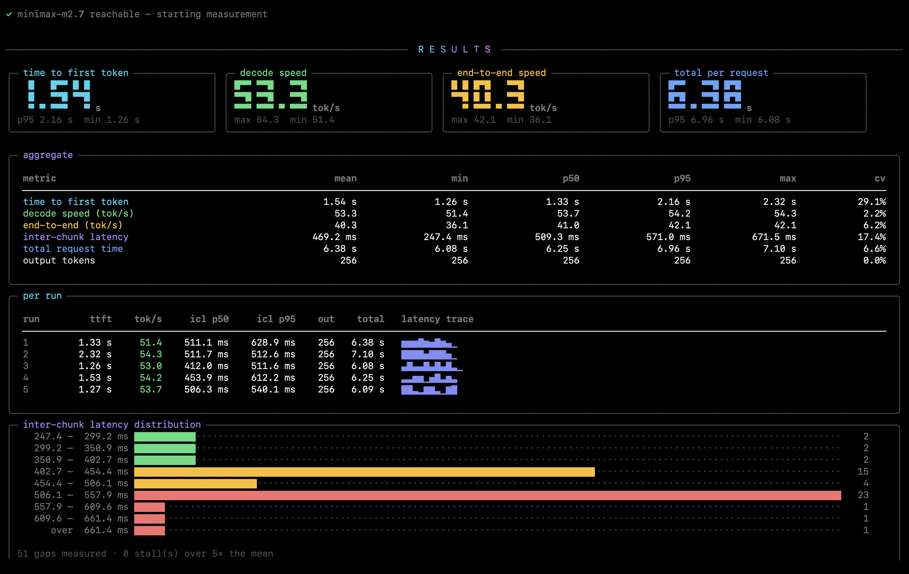

# ometer

A terminal tool that measures how fast an **Ollama Cloud** model actually serves you.



You give it a model name; it streams a few requests at the endpoint, watches every token
land, and reports time to first token, decode throughput, inter-token latency and where
the time actually went — with a live dashboard while it works.

---

## Requirements

- Python 3.8 or newer (developed against macOS system Python 3.9)
- An Ollama Cloud API key — <https://ollama.com/settings/keys>

There is no package to install and no virtualenv. These are plain scripts you run with
your existing Python.

## Setup

```sh
git clone https://github.com/aswin-kevin/ometer.git
cd ometer
pip3 install --user -r requirements.txt
```

Three libraries: `rich`, `httpx`, `python-dotenv`.

Then create a `.env` next to the scripts:

```sh
cp .env.example .env
```

and put your key in it:

```
OLLAMA_API_KEY=your_key_here
```

`OLLAMA_CLOUD_API_KEY`, `OLLAMA_KEY`, `OLLAMA_TOKEN` and `OLLAMA_AUTH_TOKEN` are accepted
too, whichever you already use. `OLLAMA_HOST` overrides the endpoint if you point at
something other than `https://ollama.com`.

`.env` is git-ignored, so your key stays local.

## Run

```sh
python3 ometer.py
```

That's the whole thing. It looks up the models your key can reach, asks which one to
measure, and goes.

Calling it by full path from another directory works too — Python puts the script's own
folder on the import path, and the `.env` beside it is still found:

```sh
python3 ~/code/ometer/ometer.py -m gpt-oss:120b-cloud
```

### Choosing a model

```
╭─ models available to your key ──────────────────────────────────────────╮
│ 1  gpt-oss:20b-cloud                                                    │
│ 2  gpt-oss:120b-cloud                                                   │
│ 3  deepseek-v3.1:671b-cloud                                             │
╰──────────── pick a number, or type a name and press Tab to complete ────╯

cloud model [gpt-oss:20b-cloud]:
```

At that prompt you can:

| Do this | Result |
| --- | --- |
| Press **Tab** | Complete the name. Matches any part of it, so `120b`<kbd>Tab</kbd> finds `gpt-oss:120b-cloud` |
| Press **Tab** twice | List every candidate, like a shell |
| Type a **number** | Pick that entry from the list |
| Press **Enter** | Accept the default in brackets |
| Type anything | Any model name works, listed or not |

Or skip the prompt entirely with `-m`:

```sh
python3 ometer.py -m gpt-oss:120b-cloud -n 10
```

## While it runs

Four gauges update as tokens arrive, over a token-budget bar, a live latency
trace, the text streaming in, and a scoreboard of finished runs:

```
╭─ ⠋ run 3 ──────────────────────────────────────────────────────────────────────────╮
│ first token          decode               tokens              elapsed              │
│ 390 ms               55.2 tok/s           137 / 256           2.8 s                │
│                                                                                    │
│ budget  ███████████████████████████████████▎······························         │
│ latency ▁▇▁▇▂▅▆▆█▃▃▅██▇▁▃▃▅▆█▃▆▇▅▅▄▅▅▇▃▅▃▇▁▅▆▁▄▆▅██▂▁▄▅▅▆█▃▆▂▆▅▄▄▆▆▄▅▅▅█▆█   16 ms │
╰────────────────────────────────────────────────────────────────────────────────────╯
╭─ response ─────────────────────────────────────────────────────────────────────────╮
│ congestion window grows exponentially during slow start until the threshold is     │
│ reached, after which the sender switches to additive increase and probes the       │
│ network more cautiously for spare capacity                                         │
╰────────────────────────────────────────────────────────────────────────────────────╯
╭─ completed ────────────────────────────────────────────────────────────────────────╮
│ warmup        610 ms      49.2 t/s  ██████████████████████████████████████▍        │
│ run 1         440 ms      53.7 t/s  █████████████████████████████████████████▉     │
│ run 2         510 ms      58.9 t/s  ██████████████████████████████████████████████ │
╰────────────────────────────────────────────────────────────────────────────────────╯
  ██████████████████████████──────────────────────────  3/6  ·  0:27.4 elapsed
```

## The report

The screenshot at the top is a real run against Ollama Cloud. The report is made of:

- **hero cards** — the four headline numbers, each with its spread underneath
- **aggregate** — every metric as mean / min / p50 / p95 / max, plus `cv` for run-to-run
  consistency
- **per run** — one row per request, with a sparkline of that run's streaming gaps
- **latency distribution** — a histogram of the streaming gaps, with a stall count
- **where the time goes** — the server-reported split of a request. Not in the screenshot,
  because Ollama Cloud does not report phase timings and ometer skips the panel rather
  than inventing numbers for it
- **verdict** — the whole thing in one line

That run is also a good example of why the labels move around. minimax-m2.7 packs roughly
23 tokens into every streamed chunk and sends one about every 470 ms, so the gap columns
read **icl** (inter-chunk) rather than itl — the client simply cannot see individual
tokens arrive. Worth knowing before you read a 469 ms "latency" as a stutter: the model is
producing 53 tokens a second, just delivering them in batches.

The report reflows between 40 and 200 columns. As the terminal narrows, table columns are
dropped and labels shortened rather than truncated, so no measurement is ever cut off
mid-word. Only the header can ellipsise, and only for things that genuinely cannot be
broken — a long endpoint URL or `.env` path below about 60 columns.

## What the numbers mean

| Metric | Meaning |
| --- | --- |
| **Time to first token (TTFT)** | Wall-clock time from sending the request to the first streamed token. Covers network, queueing and prompt prefill — the pause the user feels before anything appears. |
| **Time to first content** | Same, but ignoring reasoning tokens. Only shown for thinking models, where the visible answer starts later than the stream does. |
| **Decode speed** | Generation throughput once tokens are flowing — the number usually quoted as "tokens/sec". Taken from the server's `eval_count / eval_duration` when reported; otherwise from the token count over the wall-clock decode window. |
| **End-to-end speed** | Output tokens ÷ total request time. Lower than decode speed because it includes the wait for the first token. This is what you actually experience. |
| **Prefill speed** | Prompt tokens ÷ prompt-eval time — how fast your input was read. |
| **Inter-token latency (ITL)** | The gap between consecutive streamed tokens. The mean looks fine on almost any endpoint; **p95 and the stall count are what make a stream feel choppy**. If the server packs several tokens into one chunk this is reported as **inter-chunk latency (ICL)** instead, because per-token timing is then not observable from the client. |
| **cv** | Coefficient of variation across runs. Under 5% is rock solid, over 25% means the endpoint was erratic while you measured. |
| **Where the time goes** | Server-reported model load, prefill and generation as a share of total request time; the remainder is network and queueing. Only shown when the endpoint actually reports these phases — Ollama Cloud currently does not, so the panel is skipped there rather than guessing. |

The first request is a **warmup** and never counts, so cold start doesn't distort the
result. The HTTP connection is reused across runs, so TLS setup isn't charged to TTFT
either. A small **preflight** request runs before everything else to validate the model
name; the configuration panel shows the true total request count so nothing is hidden
from your quota.

With a single run (`-n 1`) there is no spread to measure, so `cv` reads `—` and the
verdict says *single run* rather than claiming consistency it cannot know.

## Options

```
-m, --model MODEL      cloud model name (you'll be prompted if omitted)
-n, --runs N           measured runs                          [default: 5]
-w, --warmup N         warmup runs, excluded from the stats    [default: 1]
-t, --max-tokens N     tokens to generate per run              [default: 256]
-p, --prompt TEXT      prompt to send
    --prompt-file F    read the prompt from a file
    --system TEXT      system message
    --temperature F    sampling temperature                    [default: 0]
    --seed N           sampling seed, -1 for none              [default: 42]
    --think            enable reasoning
    --no-think         disable reasoning
    --host URL         API base URL              [default: https://ollama.com]
    --env-file PATH    use a specific .env
    --timeout S        per-request timeout in seconds          [default: 300]
    --cooldown S       pause between runs                      [default: 0]
    --json PATH        write every raw number to a JSON file
    --show-sample      print a snippet of what the model wrote
    --list-models      list reachable models and exit
    --no-banner        skip the logo
    --version          print the version
```

### Examples

```sh
# ten runs against a specific model
python3 ometer.py -m gpt-oss:120b-cloud -n 10

# longer generations, keep the raw numbers
python3 ometer.py -m kimi-k2:1t-cloud -t 512 --json results.json

# your own prompt, with a pause between runs to avoid rate limits
python3 ometer.py -m deepseek-v3.1:671b-cloud --prompt-file prompt.txt --cooldown 2

# what can this key reach?
python3 ometer.py --list-models
```

## JSON output

`--json results.json` writes the configuration plus every per-run measurement — TTFT,
all the ITL percentiles, token counts, the server's duration breakdown — and the
aggregate block. Useful for tracking an endpoint over time or comparing models.

```json
{
  "tool": "ometer",
  "config": { "model": "...", "runs": 5, "max_tokens": 256, "...": "..." },
  "results": {
    "runs": [ { "run": 1, "ttft_s": 0.362, "decode_tps": 59.9, "...": "..." } ],
    "aggregate": { "ttft": { "mean": 0.429, "p95": 0.544, "...": "..." } },
    "stability": "stable"
  }
}
```

## Exit codes

| Code | Meaning |
| --- | --- |
| `0` | Success |
| `1` | Configuration problem, or the preflight check failed (bad key, unknown model, unreachable host) |
| `2` | Every run failed |
| `130` | Interrupted with Ctrl-C — whatever finished is still reported |

## Project layout

```
ometer.py        the entry point — CLI, argument parsing, interactive model prompt
cmd/
├── ui.py        live dashboard and the results report
├── bench.py     the run loop (warmup + measured runs)
├── client.py    streaming client for the Ollama Cloud API
├── metrics.py   per-run measurements, percentiles, aggregation
├── config.py    .env loading and run configuration
└── theme.py     colours, big digits, sparklines, bars
docs/report.png  the screenshot above
```

`cmd/` is an ordinary Python package; `ometer.py` imports from it and is the only file
you ever run.

## Notes

- Cloud model names generally end in `-cloud`, e.g. `gpt-oss:120b-cloud`. If a name is
  wrong you'll find out in about a second — a small preflight request runs before the
  real measurement.
- Token counts come from the server's `eval_count`. If an endpoint omits the stats block,
  ometer falls back to counting streamed chunks, which is close but not exact.
- Tab completion uses `readline`. macOS ships libedit rather than GNU readline; both are
  handled.
- Defaults are `temperature 0` and `seed 42` so runs are as comparable as possible.
  Override them if you want to measure under realistic sampling.
- **If you are hacking on this:** `cmd` is also the name of a standard-library module, and
  Python puts the script's own folder first on the import path. Inside this directory
  `import cmd` therefore finds `cmd/`, not the stdlib, which breaks `pdb` and `doctest`
  and any tool that imports them — `python3 -m pdb ometer.py` and `breakpoint()` will not
  work here. Running ometer is unaffected; it never touches those modules, and neither do
  rich, httpx or python-dotenv. Debug from another directory, or rename the package.

## License

MIT — see [LICENSE](LICENSE). Copyright (c) 2026 Aswin Venkat.
